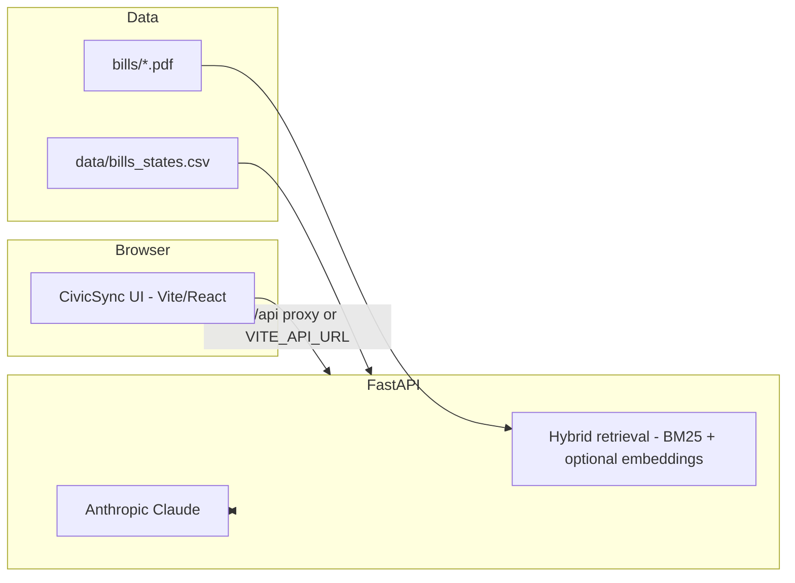

# CivicSync (Policy Explainer)

**CivicSync** is a civic-tech workspace for exploring Indian legislation with **retrieval-grounded AI**, **multi-agent deliberation**, and **ethics-oriented tooling**. It pairs a **FastAPI** backend with a **React + Vite + TypeScript** dashboard (`civicsync-ui`), with an optional **Streamlit** UI for demos.

> **Disclaimer:** Outputs are AI-generated and **not legal advice**. Always consult a qualified professional before acting on legislative information.

---

## Highlights

| Capability | What it does |
|------------|----------------|
| **Agent deliberation** | Ask questions about a bill; Sonnet summarizes with citations; specialized agents reason over retrieved sections (streaming). |
| **State bills browser** | Filter PRS-style state legislation from `data/bills_states.csv` (state, year range, keyword). |
| **Rights checker** | Structured checks against bill context. |
| **Cross-bill analysis** | Detect conflicts and overlaps between policies. |
| **Consensus map** | Visualize agreement patterns across agent outputs. |
| **Personal impact** | Persona-oriented impact framing from summaries and agents. |
| **Simulation sandbox** | Explore scenarios against bill text. |
| **Ethical audit panel** | Red-team style safeguards alongside the main workflow. |
| **PDF upload** | Upload a bill PDF for ad-hoc indexing (session-style demo store). |

---

## Architecture



---

## Tech stack

- **Backend:** Python 3.10+, FastAPI, pdfplumber, rank-bm25, Anthropic SDK, optional Voyage AI embeddings, python-dotenv.
- **Primary UI:** React 19, TypeScript, Vite 8, Tailwind CSS 4, Radix UI, Framer Motion, Recharts / Chart.js.
- **Optional UI:** Streamlit (`frontend/streamlit_app.py`).
- **Infra references:** `render.yaml` (Render), `Dockerfile` (e.g. Hugging Face Spaces). Full steps: **[DEPLOY.md](./DEPLOY.md)**.

---

## Prerequisites

- **Python** 3.10 or newer  
- **Node.js** 20+ (recommended for Vite 8) and npm  
- **Anthropic API key** (required for summarization and agents)  
- **Voyage AI API key** (optional; without it, retrieval uses BM25 only)

---

## Quick start (local)

### 1. Clone and configure the API

```bash
git clone https://github.com/vivek-k1/CivicSync-v2.git
cd CivicSync-v2

python -m venv .venv
# Windows: .venv\Scripts\activate
# macOS/Linux: source .venv/bin/activate

pip install -r requirements.txt
cp .env.example .env   # or copy on Windows: copy .env.example .env
```

Edit **`.env`** with your keys (see [Environment variables](#environment-variables)).

### 2. Run the FastAPI server

From the **repository root** (the folder that contains `app/` and `bills/`):

```bash
python -m uvicorn app.main:app --host 127.0.0.1 --port 8005 --reload
```

- **`GET /health`** should return `"status": "ok"` and a list of loaded bills.  
- Default `python -m app.main` (if you use the `__main__` block) also listens on **8005** to match the Vite proxy.

### 3. Run the CivicSync UI

```bash
cd civicsync-ui
npm install
npm run dev
```

Open the URL printed in the terminal (often **http://localhost:5173**).  
For local development, leave **`VITE_API_URL`** empty in `civicsync-ui/.env` so the browser uses **`/api`**, which Vite proxies to `http://127.0.0.1:8005`.

### 4. Optional: Streamlit

```bash
# From repository root, with venv active
streamlit run frontend/streamlit_app.py
```

---

## Environment variables

| Variable | Required | Description |
|----------|----------|-------------|
| `ANTHROPIC_API_KEY` | **Yes** (for AI features) | Claude API access for summaries and agents. |
| `VOYAGEAI_API_KEY` | No | Dense retrieval / embeddings; omit to use BM25-only mode. |
| `BHASHINI_USER_ID` | No | Optional [Bhashini](https://bhashini.gov.in/) translation (`app/translator.py`). |
| `BHASHINI_API_KEY` | No | Bhashini API key (paired with `BHASHINI_USER_ID`). |
| `STATE_BILLS_CSV` | No | Absolute path to `bills_states.csv` if not under `./data/`. |
| `CIVICSYNC_STRIP_API_PREFIX` | No | Set to `1` when the app is served behind a reverse proxy that prefixes routes with `/api` (see [DEPLOY.md](./DEPLOY.md)). |
| `STATIC_DIST` | No | Used in bundled / Docker deployments to serve the built SPA. |

**Frontend (production build):** set **`VITE_API_URL`** to the public API origin (no trailing slash), e.g. `https://your-api.onrender.com`. See [DEPLOY.md §2](./DEPLOY.md#2-deploy-the-frontend-vercel).

---

## Repository layout

```
├── app/                 # FastAPI app, RAG, LLM, agents, state bills loader
├── bills/               # Built-in bill PDFs/TXT referenced by the API
├── data/                # bills_states.csv (state browser), optional chunk cache
├── civicsync-ui/        # Main React dashboard
├── frontend/            # Streamlit alternative UI
├── tests/               # pytest suite
├── requirements.txt
├── render.yaml          # Render Blueprint (API)
├── Dockerfile           # Single-image API + static UI (e.g. HF Spaces)
├── DEPLOY.md            # Render, Vercel, Hugging Face, troubleshooting
└── README.md
```

---

## Built-in bills

The API loads acts from **`bills/`** (see `app/pdf_parser.py`):

| Key | Document |
|-----|-----------|
| `dpdp` | Digital Personal Data Protection Act 2023 |
| `social_security` | Code on Social Security 2020 |
| `bns` | Bharatiya Nyaya Sanhita 2023 |
| `telecom` | Telecommunications Act 2023 |
| `maha_rent` | Maharashtra Rent Control Act 1999 (TXT) |

Missing files are skipped at startup; check logs if a bill does not appear.

---

## API overview

| Method | Path | Purpose |
|--------|------|---------|
| `GET` | `/health` | Liveness, loaded bills, cost summary |
| `GET` | `/bills` | Bill metadata for the UI |
| `POST` | `/summarize` | Grounded Q&A over a bill |
| `POST` | `/upload-bill` | Upload a PDF for temporary use |
| `POST` | `/verdict-agents` | Multi-agent streamed analysis |
| `POST` | `/check-rights` | Rights-oriented checks |
| `POST` | `/detect-conflicts` | Cross-bill conflict detection |
| `GET` | `/state-bills/meta` | Dataset metadata for the state browser |
| `GET` | `/state-bills` | Filtered state bill rows |
| `GET` | `/cost` | Token / cost tracker summary |

---

## State bills dataset

Place **`bills_states.csv`** in **`data/`** (PRS-style columns: `date`, `file`, `house`, `bill`, `state`, `chamber`). The loader resolves, in order:

1. `STATE_BILLS_CSV` (if set and the file exists)  
2. `<repo>/data/bills_states.csv`  
3. `./data/bills_states.csv` relative to the process working directory  

The dataset is cached by file path and modification time so updates are picked up without stale empty caches.

---

## Testing

```bash
pytest
```

---

## Deployment

Step-by-step guides for **Render**, **Vercel**, and **Hugging Face Spaces** (including `CIVICSYNC_STRIP_API_PREFIX` and static UI) live in **[DEPLOY.md](./DEPLOY.md)**.

---

## Contributing

Issues and pull requests are welcome. Please keep changes focused and match existing patterns in `app/` and `civicsync-ui/`.

---

## License

This project is licensed under the **MIT License** — see [LICENSE](./LICENSE).

---

## Acknowledgments

Legislative sources are attributed in-app (e.g. India Code / Parliament of India). **Anthropic** models power the reasoning layer; optional **Voyage AI** supports embedding-based retrieval. Built for civic transparency and hackathon-style experimentation (**CivicSync**).
